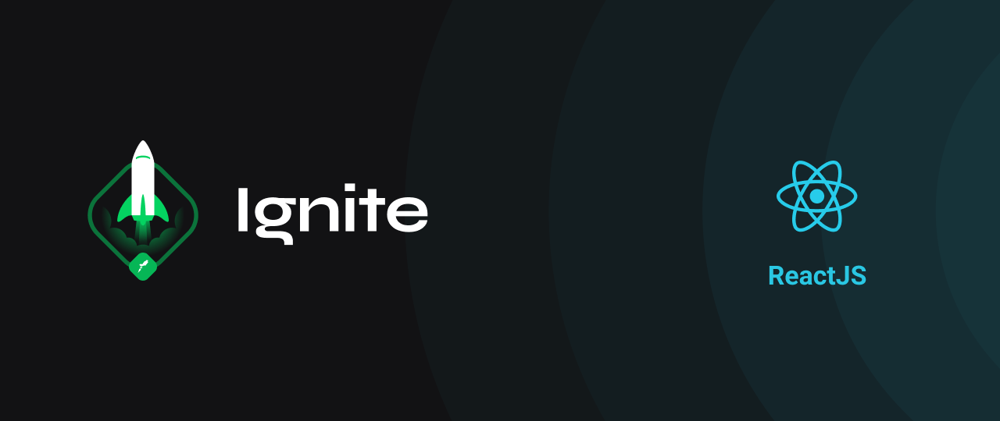

# <h2 align="center">Ignite Complementary Challenge (Trail ReactJS - Chapter I)</h2>

<h2 align="center">Complementary Challenge 01 - React Concepts (Rocketseat)</h2>

## 📑 Sobre o Desafio

A aplicação possui apenas uma funcionalidade principal que é a listagem de filmes; 
utilizando o MirageJS para simular uma API como nos dados das transações da aplicação dt.money; 
também o JSON Server para simular uma API que possui as informações de gêneros e filmes. :octocat:

É uma aplicação de listagem de filmes, onde foi colocado em prática os conceitos:

* 1º: Na sidebar é possível selecionar qual categoria de filmes deve ser listada ✔
* 2º: A primeira categoria da lista (que é "Ação") já deve começar como marcada ✔
* 3º: O header da aplicação possui apenas o nome da categoria selecionada que deve mudar dinamicamente. ✔

<h2 align="center">WatchMe</h2>

  <kbd></kbd>

<h3 align="center">#Turma_01 - Front-end Developer N/A0110629</h3>

  <kbd></kbd>

  <kbd></kbd>

#

<h3 align="center">Licença</h3>
<h6 align="center">Esse projeto está sob a licença MIT. Veja o arquivo LICENSE para mais detalhes.</h6>

  
  

---

  
    

